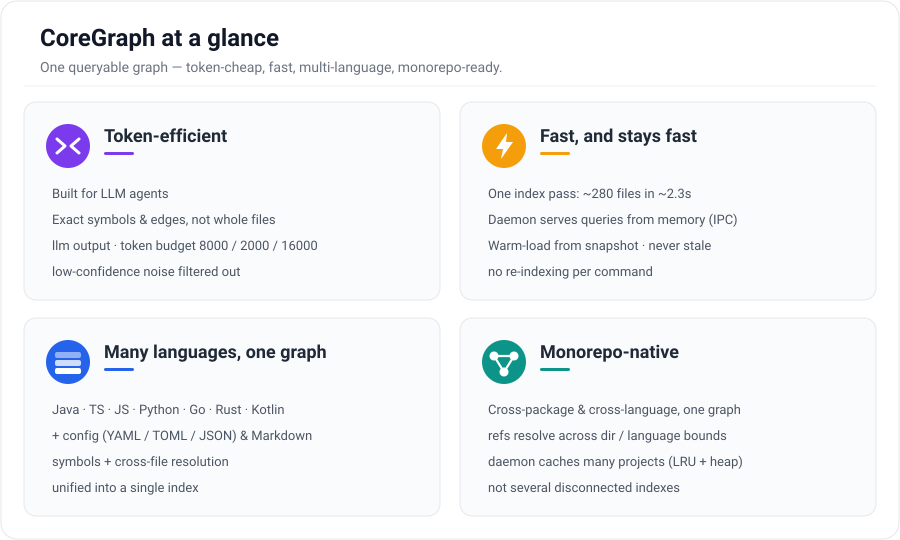
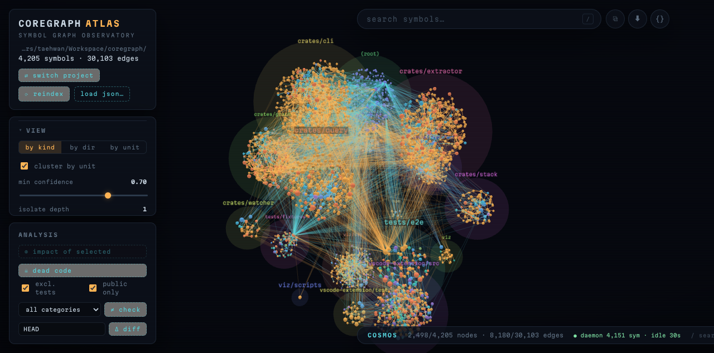
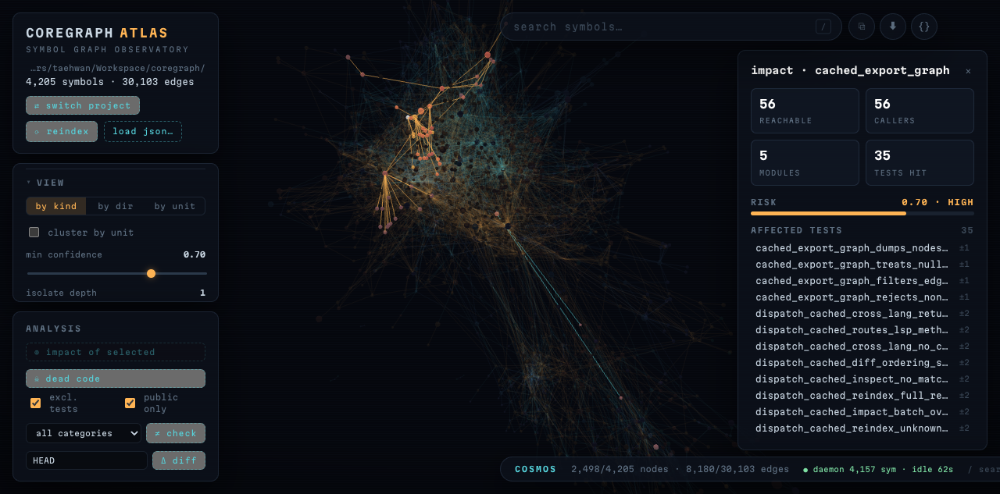
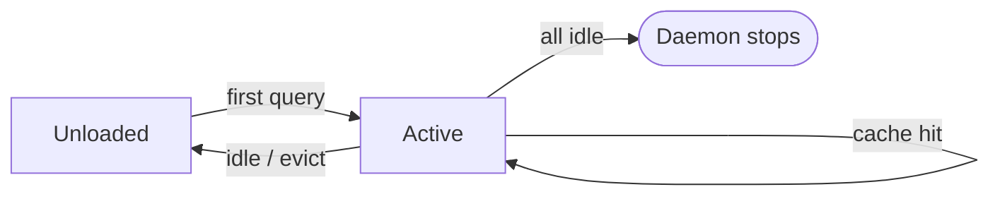
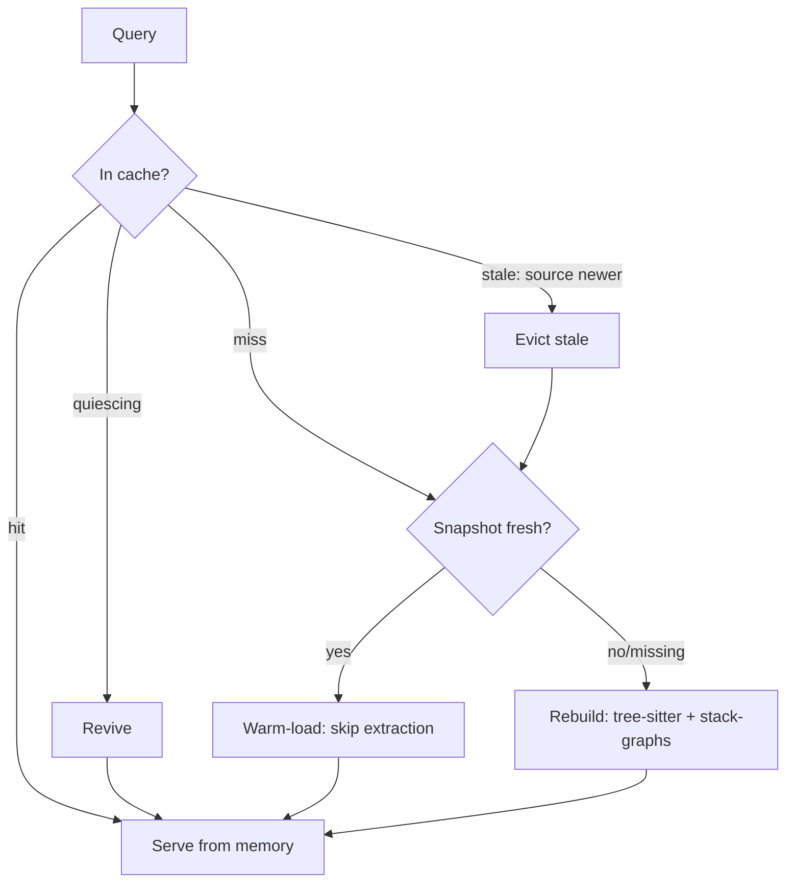
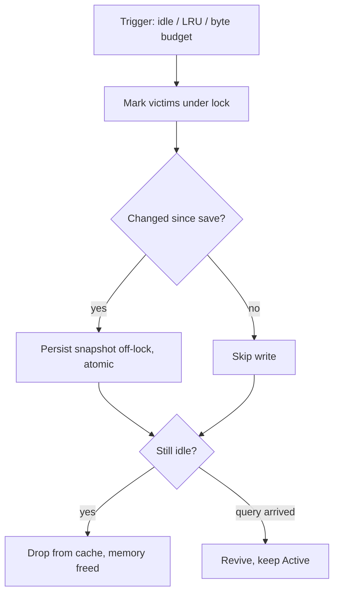
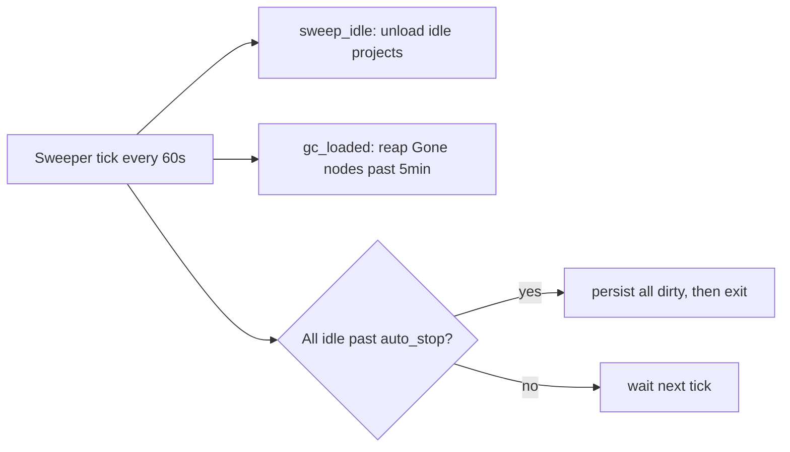

<p align="center">
  
</p>

# CoreGraph

[](https://www.npmjs.com/package/@coregraph/cli) [](LICENSE)   

One queryable code graph for multi-language and monorepo codebases — find callers, impact, dead code, and cross-file inconsistencies, with every relationship tagged by how much you can trust it.

CoreGraph is a Rust CLI (`coregraph`, v0.1.3, MIT). It indexes your source once,
serves the graph from a background daemon, and answers questions over an IPC
socket, an MCP bridge for LLM agents, an LSP bridge for editors, and an optional
HTTP API. Because every answer comes from the precomputed graph instead of
re-reading files, results are precise, fast to return, and small enough to hand
straight to an LLM — a few hundred tokens where grepping and pasting files would
cost thousands.

---

## What is CoreGraph

CoreGraph builds an in-memory **symbol graph** of your codebase by combining two
analysis layers into a single result:

- **tree-sitter** extracts symbols — functions, methods, structs, classes,
  enums, config keys, doc comments — from each file.
- **stack-graphs** resolves names *across files* — so a call site in one file
  links to the definition it actually binds to in another, not just to anything
  with the same name.

Both run inside one `coregraph index` pass — no language servers, build system,
or compiler toolchain required.

Every edge in the graph carries a **confidence score** (0.0–1.0), the **origin**
that produced it (e.g. resolved by stack-graphs vs. matched syntactically), and a
**trust model**. That means a consumer — an LLM agent or a human — can tell a
compiler-grade fact from a heuristic guess, and filter by `--min-confidence`
when it matters.

---

## Highlights

<p align="center">
  
</p>

- **Token-efficient — built for LLM agents.** Every answer comes from the
  precomputed graph, so CoreGraph returns the *exact* symbols and edges a question
  touches instead of whole files. `--output-format llm` emits compact, structured
  text; results are paged against a `--token-budget` (default `8000`; `--fast`
  caps it at `2000`, `--full` raises it to `16000`) with a live `budget: used/total`
  counter; and `--min-confidence` filters low-trust noise before it ever reaches
  the model. A caller lookup that would otherwise mean pasting several files lands
  in a few hundred tokens.
- **Fast, and stays fast.** A single `index` pass builds the whole graph (~280
  files in ~2.3s on this repo), then a background daemon serves every later query
  from memory over an IPC socket — no re-indexing per command. Idle projects are
  snapshotted to disk and **warm-load** on the next query (skipping tree-sitter
  extraction) unless a source file changed, so repeat queries are effectively
  instant and never stale.
- **Many languages, one graph.** Java, TypeScript, JavaScript, Python, Go, Rust,
  and Kotlin each get both symbol extraction *and* cross-file name resolution,
  alongside config (YAML/TOML/JSON) and Markdown layers — all unified into one
  index you query identically regardless of language.
- **Monorepo-native.** One graph spans every package, service, and language in
  the repo at once: a reference that crosses a directory or language boundary
  resolves to its real definition, so cross-package call paths and shared
  definitions are reachable in a single query rather than scattered across
  per-language indexes. The daemon caches multiple projects under an LRU with an
  optional heap budget, keeping a large polyglot repo responsive.

---

## Why CoreGraph

| Tool | What it gives you | What it misses |
|------|-------------------|----------------|
| `grep` / ripgrep | Fast text matches | No symbols, no call edges, no cross-file resolution |
| `ctags` | A symbol index | No callers/callees, no impact, single-pass only |
| Single-language LSP | Rich nav in one language | One language at a time; nothing across a polyglot monorepo |
| **CoreGraph** | A typed, cross-file, multi-language graph with confidence-tagged edges | — |

CoreGraph is built for codebases where the answer spans files and languages:
a TypeScript route that maps to a Go handler, a Spring bean wired by config, an
enum value duplicated across services. It answers "who calls this", "what breaks
if I change this", "what is dead", and "where do these disagree" — across all of
it at once.

---

## Inspired by CodeGraph

CoreGraph grew out of ideas from
[CodeGraph](https://github.com/colbymchenry/codegraph), which popularized this
pattern for AI agents: pre-index a codebase into a queryable graph so an agent
spends far fewer tokens and tool calls than scanning files. Credit to that
project for the inspiration — CoreGraph explores a different point in the same
design space, and emphasizes:

- **Confidence and trust on every edge.** Each relationship carries a 0–1
  confidence score, the origin that produced it (compiler-grade → resolved →
  syntactic → pattern → convention), and a trust model — so a consumer can tell a
  fact from a guess and filter with `--min-confidence`. Edges aren't just present
  or absent; they say how much you can rely on them.
- **Cross-file name resolution via stack-graphs.** References bind to the
  definition they actually resolve to across files, and each edge records whether
  it was *resolved* (scope-accurate) or only *matched* (syntactic) — so name
  collisions don't masquerade as real links.
- **Analyses built on the graph, not just navigation.** Cross-file inconsistency
  detection (enum / api-path / config-key / doc-drift), dead-code orphans that
  separate likely-dead from public API surface, and impact with a risk score,
  blast radius, and the tests a change affects.
- **In-memory graph, token-budgeted answers.** A background daemon serves the
  graph from memory (persist-then-free snapshots, warm-load, LRU + heap budget)
  and every result is paged against a token budget in `llm` / `json` / human
  formats.

CodeGraph covers a broader set of languages and framework integrations today;
CoreGraph trades that breadth for confidence-scored, cross-file-resolved edges and
the consistency, dead-code, and impact analyses built on top of them.

---

## Quick start

```bash
# Install the CLI from npm — puts `coregraph` on your PATH
npm install -g @coregraph/cli
# ...upgrade later to the latest:   npm install -g @coregraph/cli@latest
# ...or run it without installing:  npx @coregraph/cli@latest <command>
# ...or build from source:          cargo build --release  (binary in target/release/)
# Check the installed version:      coregraph --version

# Index the current project (creates .coregraph/config.toml on first run)
coregraph index --stats
```

> **Updating:** re-run `npm install -g @coregraph/cli@latest` to move to the newest
> release; `coregraph --version` confirms the result and the [npm version badge](https://www.npmjs.com/package/@coregraph/cli)
> shows the latest published version. A background daemon already running from an
> older version keeps serving until restarted — run `coregraph server restart` to
> load the new binary.

```
coregraph: skipped 1 minified/generated file(s) (e.g. ./vscode-extension/media/cytoscape.min.js)
Index complete — 281 files, 3396 symbols, 21342 edges (2337ms)
```

The first query auto-spawns a background daemon and reuses the cached graph for
every subsequent command.

### Find who calls a function

```bash
coregraph query compute_impact \
  --direction incoming --edge-kind calls --hop-limit 1
```

```
── query: compute_impact ──────────────────────────────────

✓ compute_impact [crates/query/src/impact.rs:27]
  kind: Function | package: query (cargo)

  Incoming (14):
  ├── calls ← run [Function] @ crates/cli/src/commands/diff.rs      [0.85] ✓
  ├── calls ← run [Function] @ crates/cli/src/commands/impact.rs      [0.85] ✓
  ├── calls ← cached_impact [Function] @ crates/cli/src/dispatch.rs      [0.85] ✓
  ├── calls ← api_impact [Function] @ crates/server/src/handlers.rs      [0.85] ✓
  └── ... (14 total)
  ✓ trust: all paths verified

── page 1/1 | 14 edges total | budget: 506/5600 tokens ──
   [n]ext page | [e]xpand <id> | [f]ilter --edge-kind | [q]uit
```

The `[0.85] ✓` on each edge is its confidence score.

### See the blast radius of a change

```bash
coregraph impact build_router --risk
```

```
Impact of 'build_router': 1251 reachable symbols, 1251 edges, depth 3
  Risk Score: 0.96 (Critical)
  Blast Radius: Critical (16 modules, 910 callers)
  Confidence-Weighted Impact: 653.500
  Affected tests: 334
    test_app (distance 2, path_confidence 0.90) — ./crates/server/src/handlers.rs
    create_app_returns_router (distance 2, path_confidence 0.90) — ./crates/server/src/lib.rs
    ... (more affected tests)
```

### Find dead-code candidates

```bash
coregraph orphans --exclude-tests
```

```
Orphan symbols (12): 7 likely dead, 5 library API surface, 0 test code
  as_kebab [Method] — crates/cli/src/commands/query.rs
  strip_api_path_prefix [Function] — crates/extractor/src/string_literal_extractor.rs [library API]
  unregister [Method] — crates/graph/src/hooks.rs [library API]
  outputChannel [Constant] — vscode-extension/src/extension.ts
  ...
```

Symbols tagged `[library API]` are public surface — reachable from outside the
crate, so flagged with lower confidence than truly unreferenced symbols.

### Detect cross-file inconsistencies

```bash
coregraph inconsistencies
```

```
Inconsistencies (63):
  [enum-mismatch] 'admin' appears in:
    - Permission.ADMIN (./tests/e2e/golden/04-inconsistencies/src/permissions.ts)
    - Role.ADMIN (./tests/e2e/golden/04-inconsistencies/src/roles.ts)
  [api-path] /a.rs vs /b.rs
    ...
```

Narrow the report with `--category <enum-mismatch|api-path|config-key|doc-drift>`.

### Get oriented in an unfamiliar codebase

```bash
coregraph stats --breakdown
```

```
symbols: 3564
edges:   22052

## Symbol kinds
  Function         1225
  Method            468
  Struct            152
  ...

## Top 20 most-referenced symbols (in-degree)
    416  cli         [Module] @ ./crates/cli/src/main.rs
    363  SymbolId    [Struct] @ ./crates/core/src/symbol.rs
    320  graph       [Module] @ ./crates/graph/src/mediator/mod.rs
    ...

## Top 20 files by symbol count
    110  ./crates/graph/src/symbol_graph.rs
    100  ./crates/cli/src/dispatch.rs
     93  ./crates/extractor/src/lib.rs
    ...
```

Start here on a repo you don't know — the most-referenced symbols and densest
files are where the architecture actually lives.

### Look up a symbol by `file:line`

```bash
coregraph inspect crates/query/src/impact.rs:33
```

```
── inspect: crates/query/src/impact.rs:33 ──
  compute_impact [Function] bytes 1128..3581
  doc::compute_impact [DocComment] bytes 531..1128

      32 /// depends on (outgoing) does not break when X changes.
  →   33 pub fn compute_impact(graph: &SymbolGraph, seed_id: SymbolId, max_depth: usize) -> ImpactResult {
      34     let mut visited: HashSet<SymbolId> = HashSet::new();
```

Resolves whatever symbol sits at a cursor position — its name, kind, byte range,
and surrounding source (default 5 lines, `--context-lines`). A `doc::…
[DocComment]` line appears only when the queried position lands inside a doc
comment's own span (as in the example above); inspecting a line in a symbol's
body does not pull in that symbol's doc comment, and the JSON output and the
editor/IPC `inspect` path carry no doc-comment data.

### See what a function depends on

```bash
coregraph query compute_impact \
  --direction outgoing --edge-kind calls --hop-limit 1
```

```
── query: compute_impact ──────────────────────────────────

✓ compute_impact [crates/query/src/impact.rs:27]
  kind: Function | package: query (cargo)

  Outgoing (3):
  ├── calls → incident_edges [Method] @ crates/graph/src/symbol_graph.rs    [0.85] ✓
  ├── calls → is_impact_bearing [Function] @ crates/query/src/impact.rs     [0.85] ✓
  └── calls → clone [Method] @ crates/graph/src/bloom.rs                     [0.85] ✓
  ✓ trust: all paths verified
```

Same query as "who calls a function", flipped: `--direction outgoing` walks to
callees/dependencies, `incoming` walks to callers.

### Pipe results into scripts or your AI assistant

```bash
coregraph query build_router --direction outgoing --edge-kind calls \
  --output-format json | jq -r '.edges[] | "\(.other_name)  [\(.current_confidence)]"'
```

```
new        [0.95]
route      [0.95]
post       [0.95]
clone      [0.95]
dispatch   [0.95]
... (22 total)
```

Every analysis command (`query`, `impact`, `diff`, `orphans`,
`inconsistencies`, `stats`, `inspect`, `index`) takes `--output-format json`, so
results drop straight into scripts and CI gates (`llm` is honored by the
commands that route through the LLM renderer; `stats`/`inspect`/`index` fall
back to human text for it). For live editor/agent use, run `coregraph lsp` or
`coregraph mcp` — see [Integrations](#integrations).

---

## Key features

- **Token-budgeted, LLM-ready output.** `--output-format llm` emits compact
  structured text, every result is paged against `--token-budget`, and
  `--min-confidence` drops low-trust noise — so an agent spends a few hundred
  tokens per answer instead of ingesting whole files.
- **Multi-language, one graph.** Seven code languages plus config and Markdown,
  unified into a single index — built for monorepos.
- **Cross-file name resolution.** stack-graphs binds references to the
  definitions they actually resolve to, across files.
- **Confidence and trust on every edge.** Each relationship is scored and
  origin-tagged; filter with `--min-confidence` (default `0.70`).
- **Impact and risk analysis.** Transitive reachability plus a risk score,
  blast radius, and the tests a change affects.
- **Dead-code detection.** Orphan symbols, separating likely-dead from public
  library surface.
- **Cross-file inconsistency checks.** Enum-value mismatches, API path drift,
  config-key drift, and doc-drift (`@param`/`:param` naming a parameter the
  signature no longer has).
- **Background daemon.** Auto-spawns on first use, caches the graph, and
  self-terminates when idle — fast repeat queries, no resident cost when unused.
- **Built-in integrations.** MCP for LLM agents, LSP for editors, and an
  optional HTTP API.
- **3D visualization.** `coregraph viz` opens an interactive in-browser atlas
  of the whole graph, fed live from the daemon.

---

## Visualize: coregraph atlas

```bash
coregraph viz            # serves http://127.0.0.1:7321 and opens the browser
```

`coregraph viz` starts a local server (127.0.0.1 only, token-guarded) with a
3D force-directed view of the symbol graph, served straight from daemon
memory — no export step. If the daemon isn't running it is started for you,
and a project picker lists everything already loaded.

<p align="center">
  
</p>

What you can do in the viewer:

- **Explore** — fuzzy symbol search, isolate a neighborhood (depth 1–3),
  inspect any symbol with its incident edges and a source preview.
- **Cluster by unit** — group nodes by module/package/crate (derived from the
  path structure) inside translucent boundary spheres, as shown above.
- **Run analyses on the graph** — impact paints the blast radius as a
  hop-distance gradient with the risk score and affected tests; dead code,
  cross-file inconsistencies, git-diff impact, and shortest path between two
  symbols are one click away.
- **Filter** — symbol/edge kinds, analysis origin, minimum confidence,
  min-degree and hub trimming, color by kind / directory / unit.
- **Share & export** — copy a link that restores the exact view, download a
  PNG capture or the visible subgraph as json-graph.
- **Stay fresh** — the viewer polls the daemon and offers a one-click reload
  when the graph changes on disk; it never resets your camera behind your back.

<p align="center">
  
</p>

---

## How it works

```
source files
     │
     ▼
 tree-sitter ──► symbols (functions, structs, config keys, doc comments, …)
     │
     ▼
 stack-graphs ─► cross-file name resolution (calls, imports, references)
     │
     ▼
 symbol graph (in memory) ──► confidence/trust-tagged edges
     │
     ▼
 background daemon ──► IPC socket │ MCP │ LSP │ HTTP
```

`coregraph index` runs both analysis layers in one pass. The resulting graph is
held by a background daemon that:

- **Auto-starts** on the first thin-client command (`query`, `stats`, `impact`,
  `orphans`, `inconsistencies`, `lsp`, `mcp`). Use `--no-auto-start` (or
  `COREGRAPH_NO_AUTO_START=1`) to build in-process instead.
- **Self-terminates** after `server start --auto-stop-minutes <N>` (default 30)
  of full idleness; `0` disables.
- **Caches multiple projects** under an LRU (`server.max_loaded_projects`,
  default 5), with an optional total-heap byte budget
  (`server.max_loaded_bytes`, `0` = unlimited).
- **Optionally serves HTTP** via `coregraph server start --http`.

### In-memory graph management

The daemon keeps each project's graph in memory only as long as it is useful,
so an idle workstation reclaims the memory automatically:

- **Idle unload (persist-then-free).** A project idle for
  `server.idle_unload_minutes` (default 10) is dropped from memory. Before it is
  freed — and likewise when LRU or the byte budget evicts it — a graph that
  changed since its last save is written to `.coregraph/snapshot.bin`. The write
  happens off the cache lock, so it never blocks concurrent queries, and a clean
  (unmodified) graph is skipped to avoid redundant disk churn.
- **Warm restart.** The next query for an unloaded project **warm-loads** the
  snapshot from disk instead of re-running tree-sitter extraction — *unless* any
  source file is newer than the snapshot's recorded build time, in which case it
  rebuilds from source. So a warm load is fast but never serves stale data.
- **Tombstone GC.** Deleted symbols are tombstoned, then reaped from every
  loaded graph by a background sweeper once they age past a 5-minute grace
  window, reclaiming their nodes, edges, and index entries.
- **Compact storage.** File paths are interned (`Arc<Path>`), so every symbol in
  the same file shares one path allocation in memory instead of holding a private
  copy. The snapshot itself stores the path per node/edge, so sharing is
  re-established when a snapshot is loaded back into memory.

Each project's graph moves through a simple lifecycle — loaded on demand,
served from memory, and unloaded (after persisting) once idle:



Where _first query_ warm-loads the snapshot (or rebuilds), _idle / evict_
persists a changed graph before freeing it, and _all idle_ auto-stops the
daemon — as detailed above.

<details>
<summary><b>Detailed flows</b> — load path, eviction, and the sweeper</summary>

**Load path** — what a single query resolves to:




**Eviction (persist-then-free)** — how a graph leaves memory without losing
changes or blocking concurrent queries:




**Background sweeper** — one tick every 60s does three things:




</details>

Snapshots are bincode binary blobs (schema v6, carrying the graph's build time).
Save and reload the graph manually with `coregraph snapshot save --out <PATH>` /
`coregraph snapshot load <PATH>`, or attach one to indexing with
`index --snapshot <PATH>`.

### Confidence and trust

Stored edge confidence is `base(edge_kind) × base(origin)`, clamped to `[0,1]`
(computed once at edge creation). The live `current_confidence` shown in query
output is `base(origin)` decayed by ×0.7 per stale evidence item — the stale
decay applies to the origin base alone, not to the stored product. The five
analysis origins, highest to lowest base confidence:

| Origin | Base | Meaning |
|--------|------|---------|
| CompilerDerived | 0.99 | Compiler-grade fact |
| NameResolved | 0.95 | Resolved by stack-graphs |
| SyntaxMatched | 0.85 | Matched syntactically (tree-sitter) |
| PatternMatched | 0.60 | Matched by a known framework pattern |
| ConventionInferred | 0.40 | Inferred from a naming/structure convention |

Edges also carry one of four trust models — `SourceEvidenced`,
`ContractDependent`, `Bidirectional`, `ExternallyMediated`. See
[`docs/confidence.md`](docs/confidence.md) and
[`docs/graph-model.md`](docs/graph-model.md) for the full schema.

---

## Languages

All seven code languages have **both** symbol extraction and cross-file name
resolution. Resolution falls back to tree-sitter syntactic matching only for
files in a language with no rules, or when resolution produces no binding.

| Language | Symbol extraction (tree-sitter) | Name resolution (stack-graphs) |
|----------|:-------------------------------:|:------------------------------:|
| Java | ✓ | ✓ (upstream) |
| TypeScript | ✓ | ✓ (upstream) |
| JavaScript | ✓ | ✓ (upstream) |
| Python | ✓ | ✓ (upstream) |
| Go | ✓ | ✓ (hand-authored `.tsg`) |
| Rust | ✓ | ✓ (hand-authored `.tsg`) |
| Kotlin | ✓ | ✓ (hand-authored `.tsg`) |
| YAML / TOML / JSON | ✓ (→ `ConfigKey` nodes) | — |
| Markdown | ✓ (documentation layer) | — |

CoreGraph's hand-authored rules live in `crates/stack/rules/{go,rust,kotlin}.tsg`.

---

## CLI overview

`coregraph <command>` — run `coregraph <command> --help` for full flags.

| Command | Purpose |
|---------|---------|
| `index` | Index source files and build the symbol graph |
| `query` | Query symbols (neighbors, callers, callees) |
| `inspect` | Inspect the symbol at `FILE:LINE` with source context |
| `stats` | Graph statistics (`--breakdown` for histograms) |
| `orphans` | List orphan symbols (dead-code candidates) |
| `impact` | Impact analysis for a symbol (`--risk` adds scoring) |
| `diff` | Impact of a git diff: which symbols a change reaches |
| `review` | Auto-comment a GitHub PR with the diff impact summary |
| `inconsistencies` | Detect enum / api-path / config-key / doc-drift issues |
| `export` | Export the graph (`dot` \| `cypher` \| `json-graph`) |
| `viz` | Serve the 3D graph viewer (atlas) on `127.0.0.1:7321` |
| `snapshot` | `save` / `load` a binary snapshot |
| `config` | `init` / `show` / `unset` / `path` |
| `server` | Daemon management: `start` / `stop` / `status` / `restart` / `install` / `uninstall` |
| `lsp` | LSP stdio bridge |
| `mcp` | MCP stdio bridge |
| `watch` | Watch files and rebuild the graph |
| `batch` | Run multiple queries from a JSON file |
| `plugin` | Manage plugin hooks: `list` / `run` |

Common global options apply to every command: `--output-format <human|llm|json>`,
`--min-confidence <0.0–1.0>` (default `0.70`), `--hop-limit <N>` (default `3`),
`--token-budget <N>` (default `8000`), `-C/--project <PATH>`, and the presets
`--fast` / `--standard` / `--full`.

> Note: `impact` uses `--max-depth <N>` (default 5) for transitive depth. The
> `--depth <N>` flag belongs to `query`.

See [`docs/cli.md`](docs/cli.md) for the complete reference.

---

## Use with AI coding agents

CoreGraph ships a ready-made kit so any AI coding agent can use it — and prefer it over a
raw grep/read sweep for structural questions (callers, change impact, dead code, cross-file
inconsistencies). Everything lives under [`agents/`](agents/README.md): the Claude Code
plugin, an `AGENTS.md` you can drop into your own project, and copy-paste MCP config for
Codex, Gemini CLI, and opencode. All of it points at one source of guidance — the bundled
skill.

**Claude Code** — install the plugin (registers the skill and the `coregraph mcp` server).
Adding the marketplace by its `marketplace.json` URL downloads only the small catalog — no
repo clone — and the plugin is sparse-fetched (only `agents/coregraph`):

```text
/plugin marketplace add https://raw.githubusercontent.com/simplecore-inc/coregraph/main/.claude-plugin/marketplace.json
/plugin install coregraph@coregraph
```

**Codex / Gemini CLI / opencode** — register `coregraph mcp` and use the `AGENTS.md`. See
[`agents/README.md`](agents/README.md) for the exact per-agent setup.

## Integrations

CoreGraph speaks three machine protocols in addition to the terminal. Details in
[`docs/integrations.md`](docs/integrations.md).

### MCP — `coregraph mcp`

A stdio JSON-RPC bridge for LLM agents, exposing five tools (plain names, no
prefix):

| Tool | Input | Returns |
|------|-------|---------|
| `query` | `{name}` | Symbols matching a name across the project |
| `impact` | `{name, transitive? = false, depth = 5}` | Transitive dependents of a symbol (who breaks if it changes) up to `depth` (default 5); `transitive` only changes the output label, so pass `depth: 1` to get just direct dependents |
| `orphans` | `{}` | Dead-code candidates: code symbols with no incoming or outgoing edges |
| `inconsistencies` | `{}` | Cross-file inconsistencies: enum / api-path / config-key (doc-drift is CLI-only) |
| `stats` | `{}` | Graph summary: symbol count and edge count |

Register it with an MCP client (Claude Code `.mcp.json` or
`claude_desktop_config.json`):

```json
{ "mcpServers": { "coregraph": { "command": "coregraph", "args": ["mcp"] } } }
```

### LSP — `coregraph lsp`

A stdio LSP bridge for editors. Provides three methods:

- `textDocument/definition`
- `textDocument/references`
- `workspace/symbol`

> ⚠ **VS Code extension — in development, not yet tested.** A companion VS Code
> extension that surfaces reach, impact, and confidence in the editor lives under
> [`vscode-extension/`](vscode-extension/README.md). It is a work in progress,
> has not been verified end to end, and is not recommended for daily use yet.

### HTTP — `coregraph server start --http`

An optional REST API bound to `127.0.0.1:27787` by default (use
`--allow-external` to bind a non-localhost address).

| Method | Route | Purpose |
|--------|-------|---------|
| GET | `/health` | Liveness + version + symbol count |
| POST | `/query` | Look up symbols by name |
| POST | `/batch` | Run several name queries at once |
| GET | `/api/query` | Paginated symbol query (`page`/`page_size`); the `budget` param is echoed back as metadata but does not truncate the response |
| GET | `/api/expand` | Expand a node's incoming/outgoing edges (returns all of them; its `budget` param is likewise echo-only) |
| GET | `/api/impact` | Transitive impact for a symbol |
| GET | `/api/source` | Source snippet around `FILE:LINE` |

---

## Configuration

A per-project config file is created at `<project>/.coregraph/config.toml` on
first index. View the effective config with `coregraph config show`:

```
  limits.token_budget            = 8000          [project]
  limits.hop_limit               = 3             [project]
  limits.min_confidence          = 0.7           [project]
  server.max_loaded_projects     = 5             [project]
  server.graceful_shutdown_sec   = 30            [project]
  server.idle_unload_minutes     = 10            [project]
  server.max_loaded_bytes        = 0             [project]
```

All `server.*` keys are read by the daemon at start (project-local config
overrides global). Example `config.toml`:

```toml
[limits]
hop_limit = 3          # query traversal depth
min_confidence = 0.7   # minimum edge confidence to report
token_budget = 8000    # LLM-mode page size

[server]
max_loaded_projects = 5      # daemon LRU cache size (project count)
max_loaded_bytes = 0         # total heap budget across loaded graphs; 0 = unlimited
idle_unload_minutes = 10     # unload (and snapshot) a project after this idle time
graceful_shutdown_sec = 30   # in-flight grace before hard-exit

[index]
exclude = []   # gitignore-syntax patterns to skip during indexing
```

Any limit can be overridden per invocation with `--hop-limit`,
`--min-confidence`, or `--token-budget`. A global config also lives at the
platform config directory (`dirs::config_dir()`) — on Linux this honors
`$XDG_CONFIG_HOME/coregraph/config.toml`, on macOS it is
`~/Library/Application Support/coregraph/config.toml` (run `coregraph config
path` to print the exact location).

> Note: project-local `[limits]` values are shown by `config show` (tagged
> `[project]`) but are **not** applied at runtime — only `[limits]` from the
> global config or a `--config` file are merged into the effective limits. Use
> the per-invocation flags above for project-specific limits. The `[server.*]`
> keys are read from the project-local config as documented.

---

## Troubleshooting

- **Stale results after editing files.** Re-run `coregraph index` — it always
  rebuilds the graph from source and never reuses an existing snapshot, so a
  plain reindex is already a fully fresh build. For continuous updates,
  `coregraph watch` (incremental by default; `--no-incremental` forces full
  rebuilds).
- **Don't want a background daemon.** Pass `--no-auto-start`, or set
  `COREGRAPH_NO_AUTO_START=1`, to build and answer in-process.
- **Daemon won't stop / is stale.** `coregraph server stop`, then re-run your
  command to respawn a fresh daemon. Check `coregraph server status`.
- **Noisy `inconsistencies` output.** A repo's own test fixtures can produce
  fixture-only noise. Narrow with `--category <enum-mismatch|api-path|config-key|doc-drift>`,
  or add `exclude` patterns under `[index]` in `config.toml`.
- **`orphans` lists public API as dead.** Symbols tagged `[library API]` are
  public surface; use `--public-only=false` to also include private symbols, or
  `--exclude-tests` to drop test code.
- **HTTP API not reachable from another host.** It binds localhost by default;
  add `--allow-external` (and review [`docs/security.md`](docs/security.md)).

---

## Documentation

- [`docs/overview.md`](docs/overview.md) — Project intent and design philosophy
- [`docs/architecture.md`](docs/architecture.md) — Crate layout and runtime
- [`docs/cli.md`](docs/cli.md) — Full CLI reference
- [`docs/graph-model.md`](docs/graph-model.md) — Node/edge schema and trust tiers
- [`docs/confidence.md`](docs/confidence.md) — Confidence and trust math
- [`docs/change-tracking.md`](docs/change-tracking.md) — File watching and incremental updates
- [`docs/integrations.md`](docs/integrations.md) — MCP / LSP / HTTP details
- [`docs/security.md`](docs/security.md) — Threat model and binding controls
- [`docs/contributing/development.md`](docs/contributing/development.md) — Building from source, local install, and the dev workflow
- [`docs/contributing/testing.md`](docs/contributing/testing.md) — Test strategy, fixtures, and the e2e suites
- [`docs/roadmap.md`](docs/roadmap.md) — Status and what's planned
- [`CHANGELOG.md`](CHANGELOG.md) — User-visible changes

---

## License

MIT — see [`LICENSE`](LICENSE).
